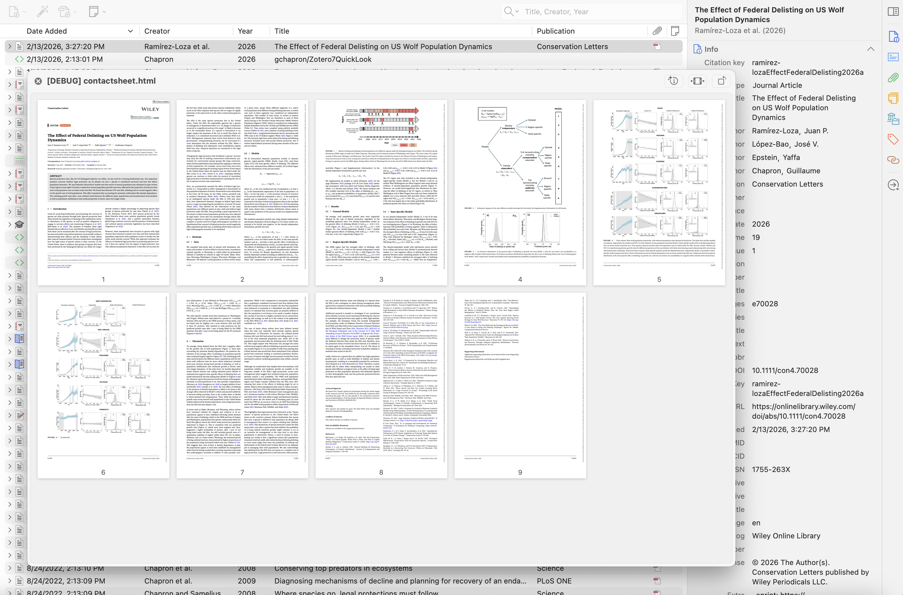

# Zotero7QuickLook

A Zotero 7/8 plugin for macOS that lets you preview attachments with QuickLook by pressing **Space** — just like in Finder.

Spiritual successor to [ZoteroQuickLook](https://github.com/mronkko/ZoteroQuickLook), which supported Zotero 4–6 but broke with Zotero 7's new plugin architecture.



## Features

- **Space** — Toggle QuickLook preview on the selected item (prefers PDF over other attachments)
- **Shift+Space** — Preview the notes attached to the selected item
- **Option+Space** — Preview a PDF as a contact sheet (grid of all page thumbnails, adaptive layout for few-page PDFs)
- **Cmd+Y** — Alternative toggle shortcut
- **Escape** — Close the preview
- **Right-click → Quick Look** — Context menu entry
- **Right-click → Quick Look Contact Sheet** — Context menu entry for contact sheet
- Works with PDFs, images, HTML, and any file type that macOS QuickLook supports
- Selecting a parent item previews its PDF attachment; falls back to the first available attachment if no PDF exists
- Notes are rendered as HTML and previewed
- Synced files that aren't downloaded locally are fetched automatically

## Requirements

- **macOS** (uses the native `qlmanage` QuickLook command)
- **Zotero 7** or later
- **macOS 12 (Monterey)** or later (for the contact sheet feature)

## Installation

1. Download the latest `.xpi` file from the [Releases](https://github.com/gchapron/zotero7quicklook/releases) page
2. In Zotero, go to **Tools → Add-ons**
3. Click the gear icon → **Install Add-on From File...**
4. Select the downloaded `.xpi` file
5. Restart Zotero

## Building from source

Requires Xcode Command Line Tools (for compiling the Swift contact sheet binary).

```bash
git clone https://github.com/gchapron/zotero7quicklook.git
cd zotero7quicklook
# Compile the contact sheet binary (universal: arm64 + x86_64)
swiftc -O -target arm64-apple-macosx12.0 -o contactsheet-arm64 contactsheet.swift
swiftc -O -target x86_64-apple-macosx12.0 -o contactsheet-x86_64 contactsheet.swift
lipo -create contactsheet-arm64 contactsheet-x86_64 -output contactsheet
rm contactsheet-arm64 contactsheet-x86_64
# Package the plugin
zip -r zotero7quicklook.xpi manifest.json bootstrap.js quicklook.js prefs.js contactsheet
```

The resulting `zotero7quicklook.xpi` can be installed in Zotero as described above.

## How it works

The plugin registers a keyboard listener on Zotero's items tree. When you press Space, it resolves the file path of the selected item's attachment and launches `/usr/bin/qlmanage -p <file>` as a subprocess. The subprocess handle is retained so that pressing Space again (or Escape) kills the process and closes the preview.

The contact sheet feature (Option+Space) uses a pre-compiled universal binary (arm64 + x86_64) that renders all PDF pages as thumbnails in a scrollable HTML grid using CoreGraphics. The binary is bundled in the `.xpi` and deployed to a temp directory on first use. The generated HTML file is then previewed via QuickLook. The layout adapts to the number of pages: PDFs with few pages (1–4) use fewer columns and higher-resolution thumbnails so they fill the preview width instead of leaving empty space.

## License

MIT
